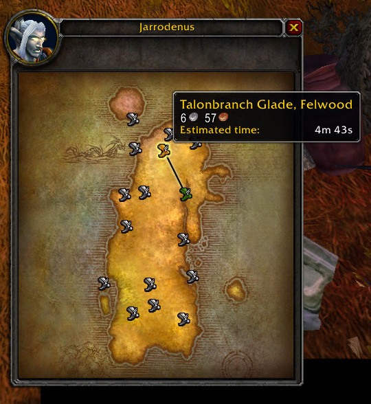
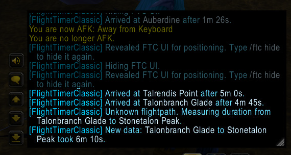

# Classic Flight Timer

Record and display flight durations for Classic WoW.

Available commands: 

* `/ftc mute` – Enable/disable information in chat window.
* `/ftc show` – Show the FTC UI for positioning.
* `/ftc hide` – Hide the FTC UI.
* `/ftc debug` – Show/hide debug information about flight map buttons.
* `/ftc help` – Show help.

Huge credit to [PhanxFlightTimer](https://github.com/phanx-wow/PhanxFlightTimer), 
[InFlight](https://www.curseforge.com/wow/addons/inflight-taxi-timer) and 
[Consequence-Flightmaster](https://www.curseforge.com/wow/addons/consequence-flightmaster)
from which I more or less frankensteined this AddOn together.

License: CC BY 2.0 (https://creativecommons.org/licenses/by/2.0/)
    